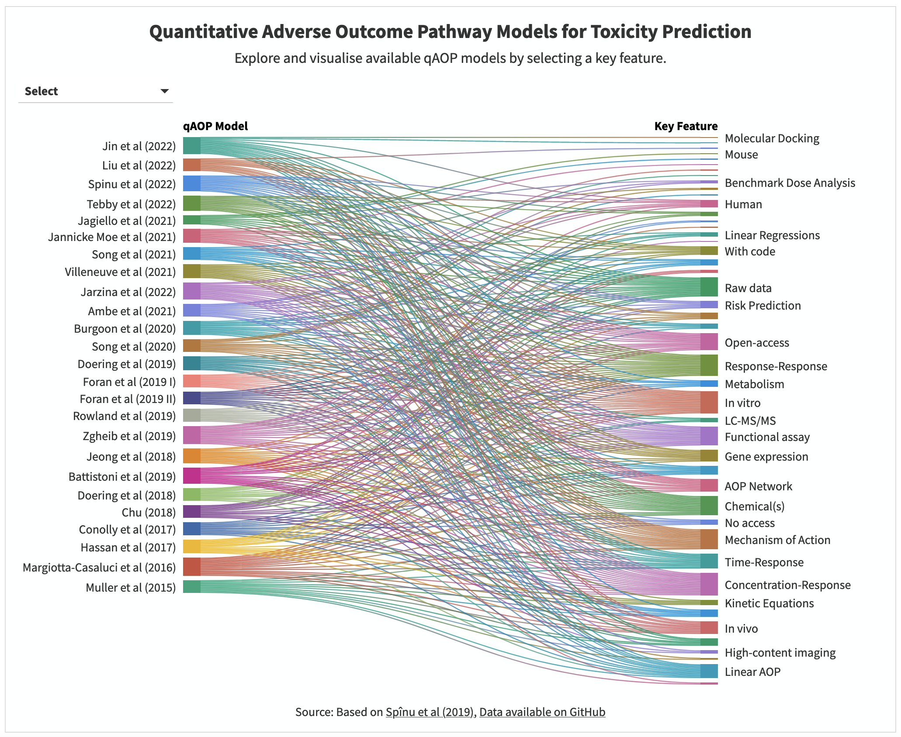

## About this Repository

### What does the Repository contain?

It has the [CSV file](data/list_qaops.csv) with the list of qAOP models published in the scientific literature by 2022 and the results of their evaluation. 
 
The qAOP models were assessed for nine key features: type of stressor(s), species, causal structure, assay, input data, methodology, output information, application, and accessibility.

### Are there any further plans?
None at the moment but feel free to propose ideas!

### How can I provide feedback and make contributions?
Please contact Mark TD Cronin at M.T.Cronin@ljmu.ac.uk and specify in the title of the email <i>qAOP Models Dashboard</i>.

### How can I access the live version of the figure?
Please go to https://public.flourish.studio/visualisation/11342208/.

### Screenshot of the live version of the figure
